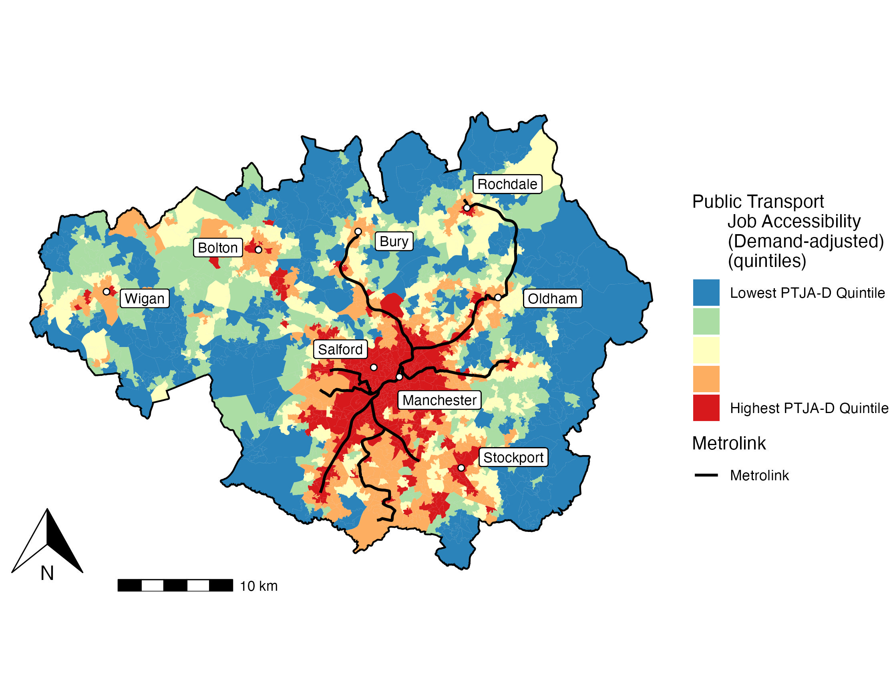
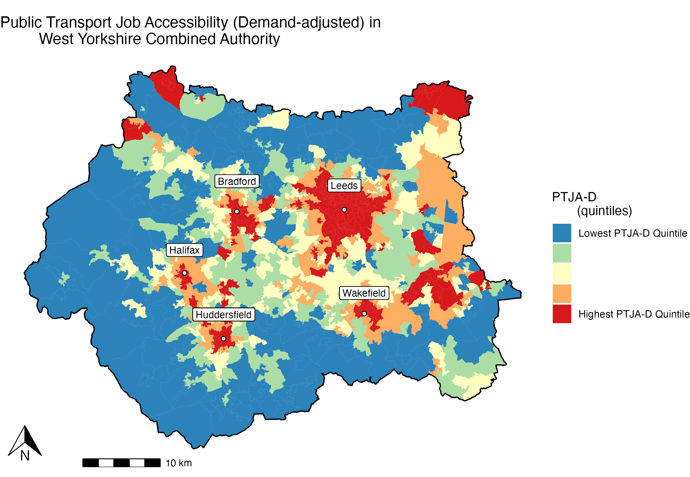
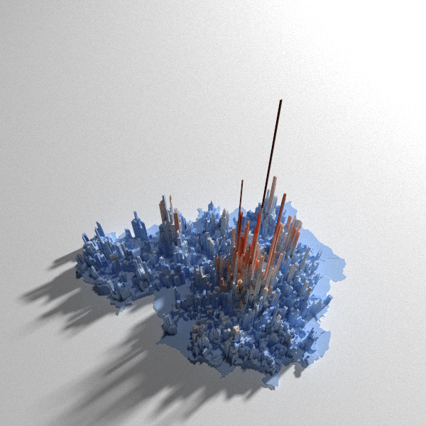
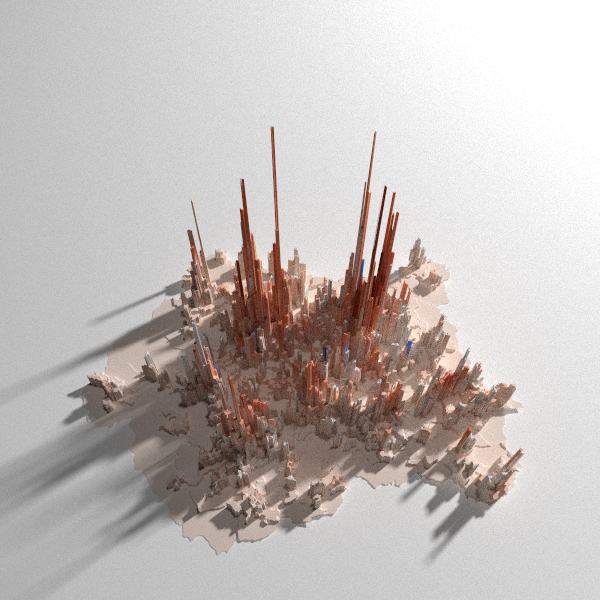

### Unemployment and Public Transport Job Accessibility (PTJA)
Urban Transport MSc at Uni of Glasgow. Dissertation project on relationship between unemployment and public transport job accessibility in Greater Manchester. Subsequently extended the study to other combined authorities for comparison.

### Public Transport Job Accessibility (Demand-adjusted)
Public transport job accessibility distribution for each area calculated by summing the numbers of jobs decayed according to travel time by public transport to their location. Travel time matrix calculated using [R5R, Rapid Realistic Routing algorithm for multi-model transit journeys](https://github.com/ipeaGIT/r5r).

PTJA distributions for Greater Manchester Combined Authority, Liverpool City Region Combined Authority and West Yorkshire Combined Authority shown below.

  
  <figcaption>Greater Manchester Combined Authority</figcaption>
  

  

### Interactive Mapping
An [interactive map of Liverpool and Manchester](https://samallwood.github.io/Unemployment_Public_Transport_Access/) showing job distributions 
from the Business Register and Employment Survey and Public Transport Job Accessibility (Demand Adjusted). There is a similar map for West Yorkshire available in the docs folder but displaying all three combined authorities on one map made the file too large for github.

### Population Distribution in GMCA and WYCA

  
  

Created using Niloy Biswas's [population density map](https://github.com/niloy-biswas/Population-Density-Map/) method.

### Project Dataset Schematic:

All datasets are publicly available from Bus Open Data Service (BODS), Rail Delivery Group, UK Data Service and ONSGeoportal. 
For full details and citations, see the final report.
