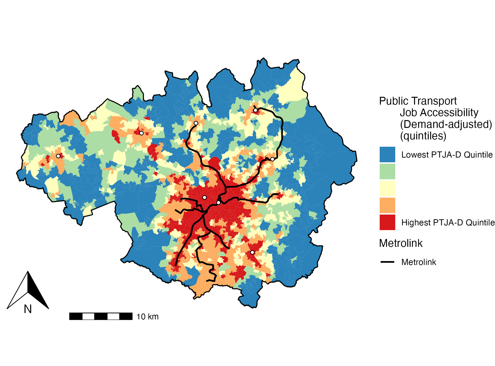
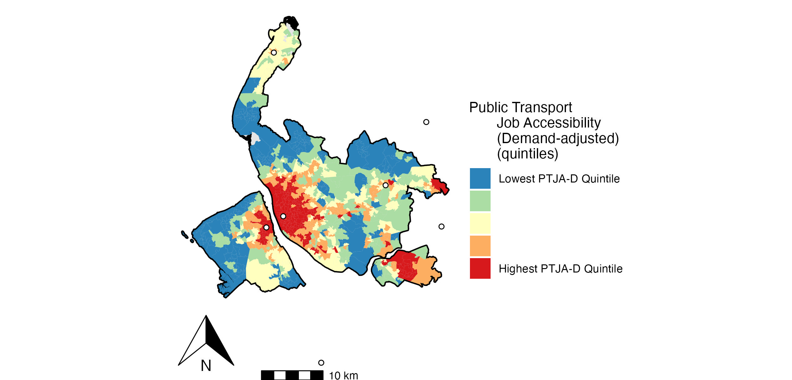
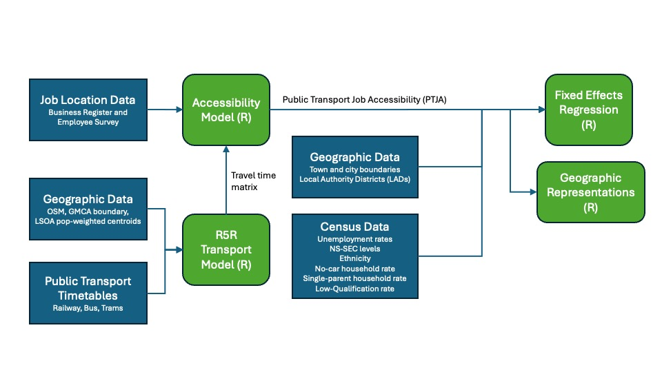

### Unemployment and Public Transport Job Accessibility (PTJA)
MSc Urban Transport at Uni of Glasgow. Dissertation project on relationship between unemployment and public transport job accessibility in Greater Manchester. Any questions, please let me know!

Public transport job accessibility distribution for an area calculated by summing the numbers of jobs decayed according to travel time by public transport to their location. Travel time matrix calculated using [R5R, Rapid Realistic Routing algorithm for multi-model transit journeys](https://github.com/ipeaGIT/r5r).

All scripts used for the project analysis and mapping are in the folders for the appropriate geography.

### Public Transport Job Accessibility (Demand-adjusted)
Greater Manchester Combined Authority (above) and Liverpool City Region (below).

  
  

### Population Distribution in GMCA:

### Project Dataset Schematic:

