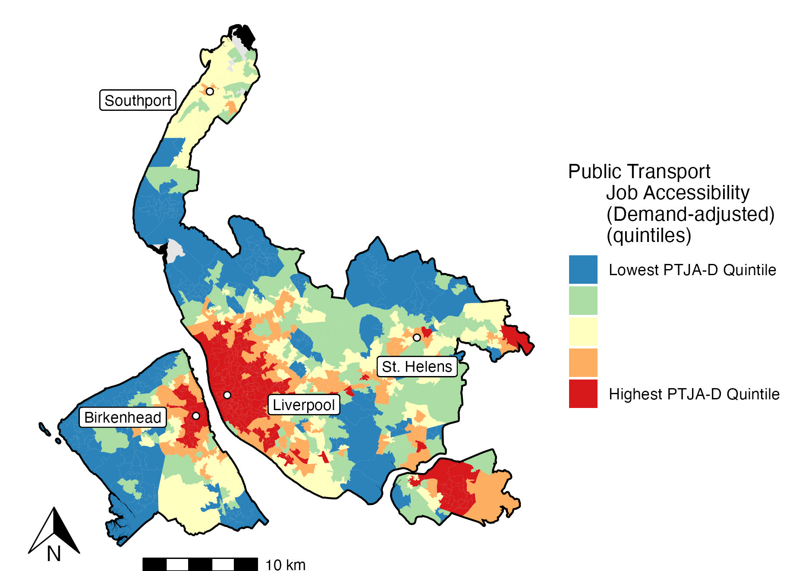

### Unemployment and Public Transport Job Accessibility (PTJA)
MSc Urban Transport at Uni of Glasgow. Dissertation project on relationship between unemployment and public transport job accessibility in Greater Manchester. Plans to extend to other combined authorities for comparison. Any questions, please let me know!

Public transport job accessibility distribution for an area calculated by summing the numbers of jobs decayed according to travel time by public transport to their location. Travel time matrix calculated using R5R, Rapid Realistic Routing algorithm for multi-model transit journeys.  

The scripts which start with '3' are for creating the distribution maps of GMCA, and there is also a presentation included in the final report directory. 

### Public Transport Job Accessibility (Demand-adjusted)

  
  

### Population Density Distribution across GMCA:

### Project Dataset Schematic:

